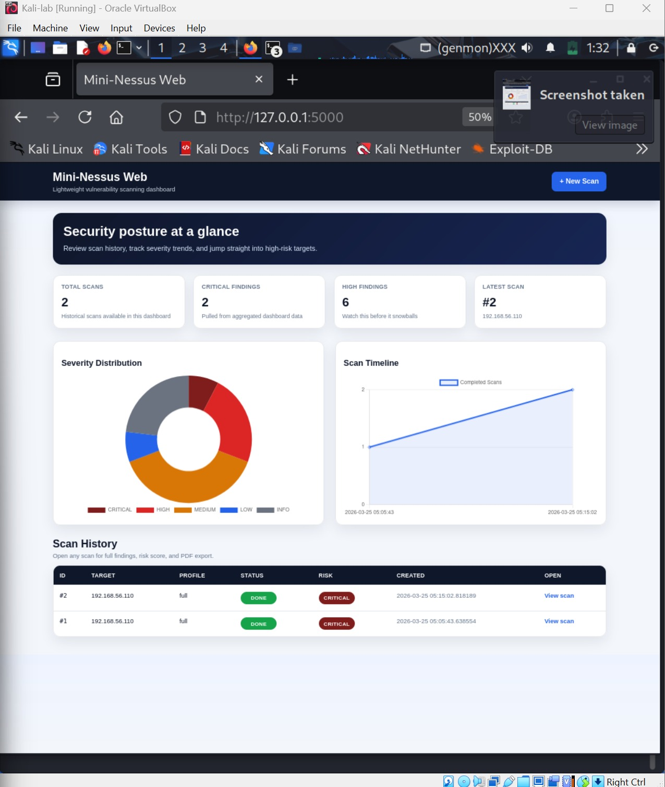
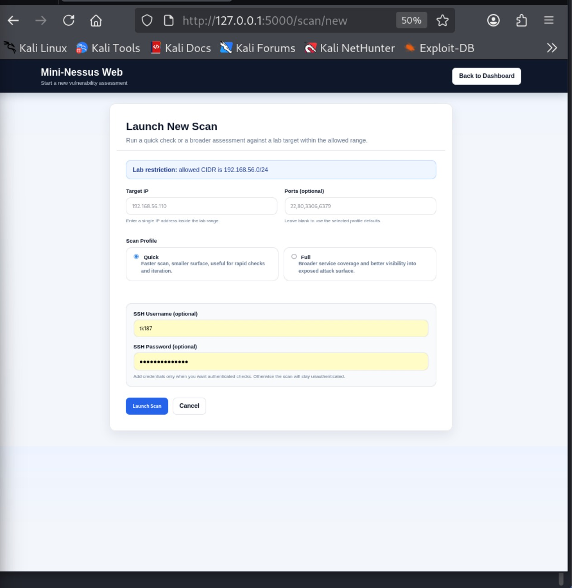
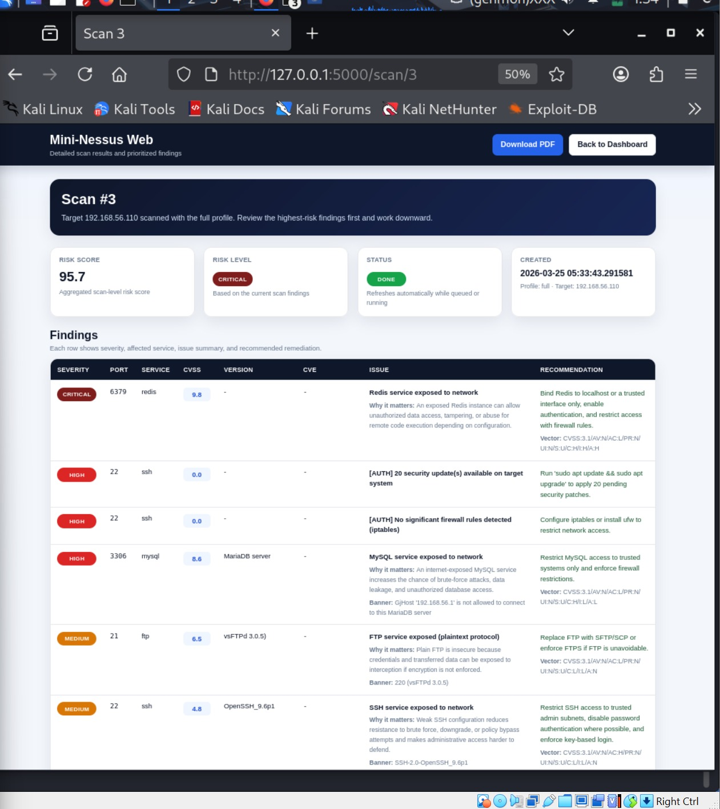
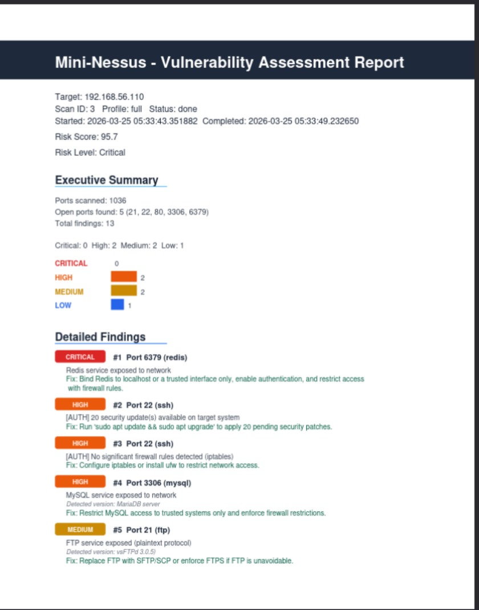
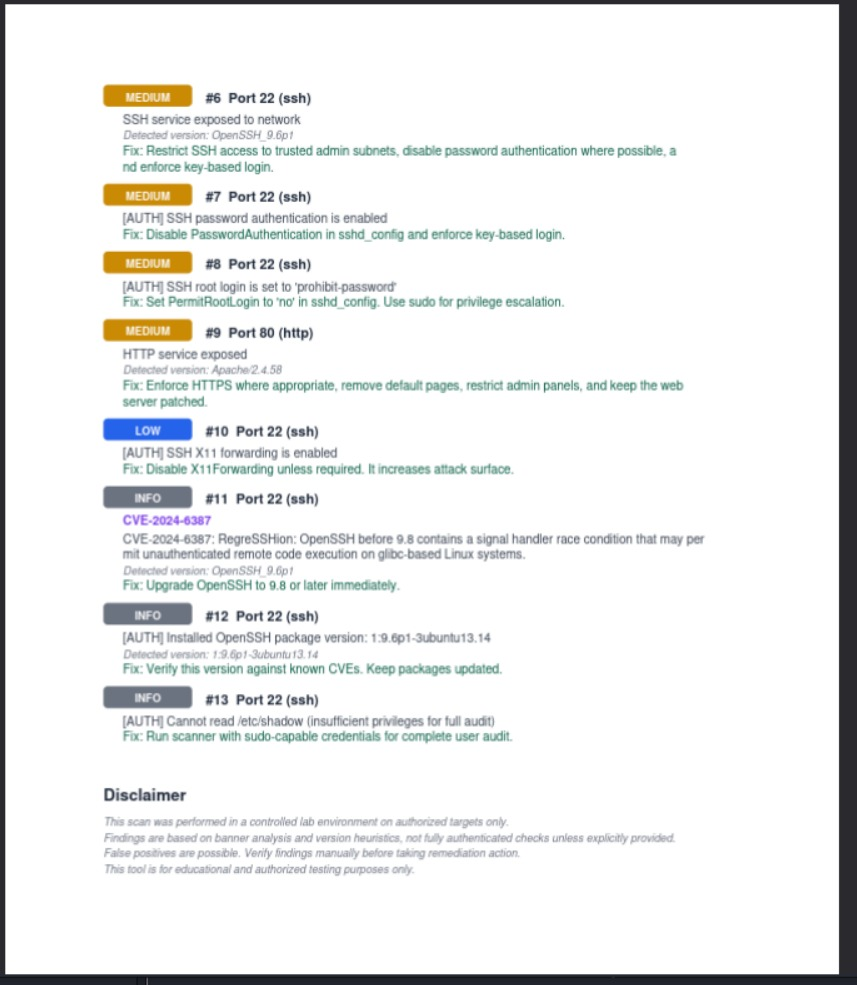

# Mini-Nessus Web

Mini-Nessus Web is a lightweight **web-based vulnerability scanner** built with **Flask**, **SQLite**, **SQLAlchemy**, **Celery**, and a custom Python scanning engine.

It was built as a practical cybersecurity portfolio project to demonstrate:

- network reconnaissance
- service fingerprinting
- rule-based vulnerability detection
- CVSS-style risk scoring
- asynchronous scan execution
- PDF reporting
- clean web dashboard design

The project is inspired by the workflow of tools like Nessus, but intentionally keeps the architecture simple, readable, and easy to extend.

---

## Features

- Web dashboard for launching and reviewing scans
- Asynchronous background scans with Celery
- Custom threaded TCP port scanner
- Service detection using banners and default port logic
- Supported service detection:
  - SSH
  - HTTP
  - FTP
  - MySQL
  - PostgreSQL
  - Redis
  - Telnet
  - SMTP
- Rule-based vulnerability checks
- Local CVE/version matching for selected services
- CVSS-style per-finding scoring
- Scan-level risk aggregation
- Authenticated SSH checks with Paramiko
- Quick and Full scan profiles
- PDF report generation with ReportLab
- Severity distribution and scan timeline charts
- SQLite persistence through SQLAlchemy
- Lab-only safety restriction using allowed CIDR validation

---

## Why I Built This

A lot of student security projects stop at “it scans ports.”

I wanted this one to go further and behave more like a real product:

1. launch a scan from a web app  
2. detect exposed services  
3. generate findings based on real rules  
4. prioritize them with realistic scoring  
5. store everything in a database  
6. present results in a usable dashboard  
7. export a professional PDF report  

This project helped me combine **offensive security concepts** with **backend engineering**, **risk prioritization**, and **reporting**.

---

## Tech Stack

### Backend
- Flask
- Flask-SQLAlchemy
- SQLite
- Celery
- Redis

### Scanning / Security Logic
- Custom Python port scanner
- Banner grabbing and service fingerprinting
- Rule-based vulnerability checks
- CVSS-style scoring
- Paramiko for authenticated SSH checks

### Reporting / Frontend
- ReportLab
- Jinja2 templates
- Chart.js
- Custom CSS

---

## Project Structure

```bash
Mini-nessus-web-main/
├── .gitignore
├── README.md
├── requirements.txt
├── main.py
│
├── app/
│   ├── .gitignore
│   ├── __init__.py
│   ├── celery_app.py
│   ├── models.py
│   ├── routes.py
│   └── tasks.py
│
├── scanner/
│   ├── banners.py
│   ├── checks.py
│   ├── engine.py
│   ├── portscan.py
│   ├── scoring.py
│   └── ssh_checks.py
│
├── reporting/
│   └── pdf.py
│
├── static/
│   └── style.css
│
└── templates/
    ├── base.html
    ├── index.html
    ├── new_scan.html
    └── scan.html
````

---

## Architecture

The project follows a clean flow:

* **`scanner/portscan.py`**
  threaded TCP port discovery

* **`scanner/banners.py`**
  banner grabbing, service guessing, version extraction

* **`scanner/checks.py`**
  baseline exposure rules and local CVE/version matching

* **`scanner/scoring.py`**
  CVSS-style enrichment and scan risk aggregation

* **`scanner/ssh_checks.py`**
  authenticated SSH checks using provided credentials

* **`scanner/engine.py`**
  orchestrates the full scan pipeline

* **`app/tasks.py`**
  runs scans asynchronously with Celery, stores findings, generates PDF

* **`app/routes.py`**
  dashboard, scan creation, scan view, PDF download, dashboard API

* **`reporting/pdf.py`**
  builds the final PDF assessment report

This keeps the scanning logic, scoring, storage, and UI responsibilities separate instead of turning the app into one giant mess.

---

## How It Works

1. A user launches a scan from the dashboard
2. Flask creates a `Scan` record in SQLite
3. Celery picks up the background job
4. The scanning engine validates the target against the allowed CIDR
5. The port scanner identifies open ports
6. Banner grabbing and service detection identify likely services
7. Rule-based checks generate findings
8. CVSS-style scoring enriches findings and calculates scan-level risk
9. Results are stored in the database
10. A PDF report is generated
11. The dashboard displays the findings and trends

---

## Current Detection / Finding Logic

### Baseline exposure checks

The scanner currently raises findings for risky exposed services such as:

* Telnet exposed
* FTP exposed
* MySQL exposed
* PostgreSQL exposed
* Redis exposed
* SSH exposed
* HTTP exposed

### Version / CVE matching

The local CVE matching logic currently includes selected checks for:

* OpenSSH
* Apache HTTP Server
* nginx
* vsFTPd
* ProFTPD
* Redis
* MySQL

### Authenticated SSH checks

When valid SSH credentials are supplied, the scanner can perform additional checks such as:

* password authentication enabled
* root login allowed
* X11 forwarding enabled
* empty passwords allowed
* Protocol 1 enabled
* missing or weak firewall configuration
* pending security updates
* risky filesystem permissions
* UID 0 users besides root

---

## Risk Scoring

This project originally used a simple weighted severity approach and was later upgraded to a **CVSS-style scoring model**.

Each finding can store:

* severity
* CVSS-style score
* CVSS vector
* impact explanation
* recommendation
* optional CVE
* rule key

Each scan stores:

* `risk_score`
* `risk_level`

This makes the output much more useful than raw severity labels alone.

---

## Frontend

The web interface includes:

* modern dashboard layout
* scan history table
* severity distribution chart
* scan timeline chart
* new scan form
* scan detail page
* PDF download button

The frontend is built with Flask templates, shared base layout, Chart.js, and a custom stylesheet.

---

## PDF Reporting

Each completed scan generates a PDF report that includes:

* target information
* scan metadata
* risk score and risk level
* executive summary
* ports scanned / open ports
* finding counts by severity
* detailed findings
* recommendations
* disclaimer section

---

## Data Models

### `Scan`

Stores high-level scan metadata:

* target
* port selection
* profile
* status
* timestamps
* error info
* risk score / risk level
* Celery task ID
* SSH auth metadata

### `Finding`

Stores finding-level data:

* port
* service
* banner
* version
* issue
* severity
* recommendation
* CVE
* CVSS score
* CVSS vector
* impact
* rule key

---

## Requirements

From `requirements.txt`:

* Flask
* Flask-SQLAlchemy
* Celery
* redis
* reportlab
* python-dotenv
* packaging
* paramiko

---

## Setup

## 1) Clone the repository

```bash
git clone https://github.com/TauqeerKhan187/mini-nessus-web.git
cd mini-nessus-web
```

## 2) Create and activate a virtual environment

### Linux / macOS

```bash
python3 -m venv venv
source venv/bin/activate
```

### Windows

```bash
python -m venv venv
venv\Scripts\activate
```

## 3) Install dependencies

```bash
pip install -r requirements.txt
```

## 4) Start Redis

Celery uses Redis as both broker and result backend.

### Linux

```bash
redis-server
```

Make sure Redis is running on:

```bash
redis://localhost:6379/0
```

## 5) Configure environment variables

Create a `.env` file in the project root:

```env
FLASK_SECRET=dev
REDIS_URL=redis://localhost:6379/0
ALLOWED_CIDR=192.168.56.0/24
HOST=0.0.0.0
PORT=5000
```

### Important

`ALLOWED_CIDR` is used as a **lab safety restriction**.
Targets outside this network will be rejected.

## 6) Start the Flask app

```bash
python main.py
```

## 7) Start the Celery worker

Open another terminal in the same project directory and run:

```bash
celery -A app.celery_app.celery worker --loglevel=info
```

---

## Usage

1. Open the dashboard in your browser
2. Click **New Scan**
3. Enter:

   * target IP
   * optional custom ports
   * scan profile (`quick` or `full`)
   * optional SSH username/password
4. Launch the scan
5. Wait for the background task to finish
6. Open the scan detail page
7. Review findings, CVSS-style scores, and recommendations
8. Download the PDF report

---

## Scan Profiles

### Quick

Targets a smaller common port list for faster feedback.

### Full

Scans ports `1-1024` plus several additional commonly exposed service ports.

---

## Security / Safety Note

This project is intentionally restricted to **lab environments**.

The scanner validates the target IP against `ALLOWED_CIDR` before scanning.
That means it will refuse to scan anything outside the permitted network range.

This tool is for:

* educational use
* local labs
* authorized internal testing only

Do **not** use it against systems you do not own or have explicit permission to assess.

---

## What I Improved During Development

Key upgrades made during development include:

* fixing MySQL and Redis detection
* improving quick / full port profile behavior
* replacing simple weighted scoring with CVSS-style scoring
* adding per-finding impact explanations
* adding scan-level risk aggregation
* storing CVSS fields in the database
* improving PDF layout and clarity
* redesigning the frontend into a cleaner dashboard
* moving repeated template styles into shared layout + stylesheet
* adding dashboard charts for severity and scan history

---

## Limitations

This is still a lightweight scanner, not a full commercial vulnerability management platform.

Current limitations include:

* banner/version-based checks can produce false positives
* no deep authenticated Linux audit beyond SSH checks
* no plugin marketplace or dynamic plugins
* no user authentication or multi-user support
* no scheduling or recurring scan system
* no asset grouping or tagging
* no REST API auth layer
* SQLite is fine for local use, but not ideal for large-scale deployment

---

## Future Improvements

Planned or possible next steps:

* Top 3 Risks section in the PDF
* richer CVE coverage
* better authenticated checks
* JSON / CSV export
* asset inventory support
* scan scheduling
* multi-target support
* PostgreSQL deployment version
* login / user roles
* filtering and sorting in the UI
* remediation tracking

---

## Screenshots

The application includes a modern Flask-based dashboard for launching scans, reviewing findings, tracking severity trends, and exporting PDF reports.

### Dashboard
Shows the main overview with severity distribution, scan timeline, and scan history.



### New Scan
Launch a quick or full scan, with optional SSH credentials for authenticated checks.



### Scan Detail
Displays scan-level risk, prioritized findings, CVSS-style scores, impact explanation, and remediation guidance.



### PDF Report
Exports a clean vulnerability assessment report with an executive summary and detailed findings.




Skills Demonstrated

This project demonstrates practical work in:

* Python
* Flask
* SQLAlchemy
* SQLite
* Celery
* Redis
* Paramiko
* asynchronous task orchestration
* port scanning
* service fingerprinting
* vulnerability detection logic
* risk scoring
* PDF generation
* web dashboard design
* project architecture

---

## Author

**TK**
Cybersecurity student building practical security tools and portfolio-grade projects.

```
